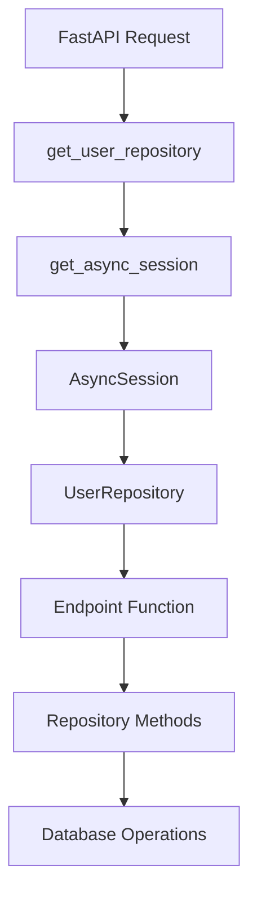

# Архитектура Repository с Dependency Injection

## Обзор

В данном проекте Quiz App реализован паттерн **Dependency Injection** для репозиториев, где:

1. **Репозиторий принимает `db` как аргумент в `__init__`**
2. **Репозиторий пробрасывается в эндпоинт через `Depends`**

Это обеспечивает:

- ✅ Чистый код в эндпоинтах
- ✅ Легкое тестирование с моками
- ✅ Автоматическое управление жизненным циклом сессии БД
- ✅ Соответствие принципам SOLID

## Архитектура

### 1. Базовый репозиторий

```python
# src/repositories/base.py
class BaseRepository(Generic[ModelType, CreateSchemaType, UpdateSchemaType]):
    def __init__(self, model: Type[ModelType], db: AsyncSession):
        """
        Initialize repository with model class and database session.

        Args:
            model: SQLAlchemy model class
            db: Database session
        """
        self.model = model
        self.db = db  # 🔑 Ключевое изменение - db хранится в экземпляре

    async def create(self, *, obj_in: CreateSchemaType) -> ModelType:
        # Методы больше не принимают db параметр
        obj_data = obj_in.model_dump()
        db_obj = self.model(**obj_data)
        self.db.add(db_obj)  # Используем self.db
        await self.db.commit()
        await self.db.refresh(db_obj)
        return db_obj
```

### 2. Специализированный репозиторий

```python
# src/repositories/user.py
class UserRepository(BaseRepository[User, UserCreate, UserUpdate]):
    def __init__(self, db: AsyncSession):
        """Initialize UserRepository with database session."""
        super().__init__(User, db)  # 🔑 Передаем db в базовый класс

    async def get_by_email(self, email: str) -> Optional[User]:
        # Методы не принимают db - используют self.db
        return await self.get_by_field("email", email)

    async def search_users(self, search_term: str, *, skip: int = 0, limit: int = 100) -> List[User]:
        search_pattern = f"%{search_term}%"
        query = (
            select(User)
            .where(or_(
                User.username.ilike(search_pattern),
                User.email.ilike(search_pattern),
                User.display_name.ilike(search_pattern),
            ))
            .offset(skip)
            .limit(limit)
        )
        result = await self.db.execute(query)  # 🔑 Используем self.db
        return result.scalars().all()
```

### 3. Dependency функция

```python
# src/repositories/dependencies.py или прямо в роутере
from fastapi import Depends
from sqlalchemy.ext.asyncio import AsyncSession
from database import get_async_session

def get_user_repository(
    db: AsyncSession = Depends(get_async_session),
) -> UserRepository:
    """
    Dependency function для получения UserRepository.

    Args:
        db: Database session (инжектируется автоматически FastAPI)

    Returns:
        UserRepository: Настроенный экземпляр репозитория с db сессией
    """
    return UserRepository(db)  # 🔑 Создаем репозиторий с db
```

### 4. Использование в эндпоинтах

```python
# src/routers/example_with_repo.py
from fastapi import APIRouter, Depends, HTTPException
from repositories.user import UserRepository

router = APIRouter()

@router.get("/users/{user_id}")
async def get_user_by_id(
    user_id: int,
    user_repo: UserRepository = Depends(get_user_repository),  # 🔑 Инжектируем репозиторий
):
    """
    Получение пользователя по ID через репозиторий.

    Преимущества:
    - Чистый код без прямого обращения к db
    - Автоматическое управление сессией
    - Легко тестировать с моками
    """
    user = await user_repo.get(user_id)  # 🔑 Используем репозиторий напрямую

    if not user:
        raise HTTPException(status_code=404, detail="Пользователь не найден")

    return UserResponse.model_validate(user)

@router.post("/users")
async def create_user(
    user_data: UserCreate,
    user_repo: UserRepository = Depends(get_user_repository),  # 🔑 Тот же паттерн
):
    # Проверяем существующего пользователя
    existing_user = await user_repo.get_by_email(user_data.email)
    if existing_user:
        raise HTTPException(status_code=400, detail="Email уже используется")

    # Создаем нового пользователя
    new_user = await user_repo.create(obj_in=user_data)
    return UserResponse.model_validate(new_user)

@router.get("/users/search/{search_term}")
async def search_users(
    search_term: str,
    skip: int = 0,
    limit: int = 100,
    user_repo: UserRepository = Depends(get_user_repository),
):
    users = await user_repo.search_users(
        search_term=search_term, skip=skip, limit=limit
    )
    return [UserResponse.model_validate(user) for user in users]
```

## Как работает Dependency Injection

### Поток выполнения:

1. **FastAPI получает запрос** → `/users/123`

2. **FastAPI видит зависимость** → `user_repo: UserRepository = Depends(get_user_repository)`

3. **FastAPI вызывает dependency функцию** → `get_user_repository()`

4. **Внутри dependency функции:**

   ```python
   def get_user_repository(db: AsyncSession = Depends(get_async_session)):
       # FastAPI автоматически вызывает get_async_session() и передает db
       return UserRepository(db)  # Создаем репозиторий с этой сессией
   ```

5. **FastAPI передает созданный репозиторий в эндпоинт** → `get_user_by_id(user_id, user_repo)`

6. **В эндпоинте используем репозиторий** → `user = await user_repo.get(user_id)`

7. **Репозиторий использует свою сессию** → `self.db.execute(query)`

8. **FastAPI автоматически закрывает сессию** после завершения запроса

### Диаграмма зависимостей:



## Преимущества новой архитектуры

### ✅ Чистый код в эндпоинтах

**Старый способ:**

```python
async def get_user(user_id: int, db: AsyncSession = Depends(get_async_session)):
    # Много низкоуровневой работы с БД в эндпоинте
    query = select(User).where(User.id == user_id)
    result = await db.execute(query)
    user = result.scalars().first()
    if not user:
        raise HTTPException(...)
    return user
```

**Новый способ:**

```python
async def get_user(user_id: int, user_repo: UserRepository = Depends(get_user_repository)):
    # Чистая бизнес-логика
    user = await user_repo.get(user_id)
    if not user:
        raise HTTPException(...)
    return user
```

### ✅ Легкое тестирование

```python
# tests/test_endpoints.py
async def test_get_user():
    # Создаем мок репозитория
    mock_repo = Mock(spec=UserRepository)
    mock_repo.get.return_value = test_user

    # Переопределяем зависимость
    app.dependency_overrides[get_user_repository] = lambda: mock_repo

    # Тестируем эндпоинт
    response = client.get("/users/1")
    assert response.status_code == 200
```

### ✅ Переиспользование репозиториев

```python
# Один репозиторий можно использовать в разных эндпоинтах
@router.get("/users/{user_id}")
async def get_user(user_repo: UserRepository = Depends(get_user_repository)): ...

@router.patch("/users/{user_id}")
async def update_user(user_repo: UserRepository = Depends(get_user_repository)): ...

@router.delete("/users/{user_id}")
async def delete_user(user_repo: UserRepository = Depends(get_user_repository)): ...
```

### ✅ Автоматическое управление сессиями

- **FastAPI автоматически** создает и закрывает сессии БД
- **Нет утечек** соединений
- **Транзакции** управляются правильно
- **Исключения** правильно обрабатываются

## Миграция существующих эндпоинтов

### Шаг 1: Обновить сигнатуру эндпоинта

**До:**

```python
async def get_users(
    skip: int = 0,
    limit: int = 100,
    session: AsyncSession = Depends(get_async_session),
):
```

**После:**

```python
async def get_users(
    skip: int = 0,
    limit: int = 100,
    user_repo: UserRepository = Depends(get_user_repository),
):
```

### Шаг 2: Заменить прямые запросы к БД на методы репозитория

**До:**

```python
query = select(User).offset(skip).limit(limit)
result = await session.execute(query)
users = result.scalars().all()
```

**После:**

```python
users = await user_repo.get_multi(skip=skip, limit=limit)
```

### Шаг 3: Использовать специфичные методы репозитория

**До:**

```python
query = select(User).where(User.email == email)
result = await session.execute(query)
user = result.scalars().first()
```

**После:**

```python
user = await user_repo.get_by_email(email)
```

## Создание новых репозиториев

### 1. Создать класс репозитория:

```python
class SurveyRepository(BaseRepository[Survey, SurveyCreate, SurveyUpdate]):
    def __init__(self, db: AsyncSession):
        super().__init__(Survey, db)

    async def get_active_surveys(self) -> List[Survey]:
        query = select(Survey).where(Survey.is_active == True)
        result = await self.db.execute(query)
        return result.scalars().all()
```

### 2. Создать dependency функцию:

```python
def get_survey_repository(db: AsyncSession = Depends(get_async_session)) -> SurveyRepository:
    return SurveyRepository(db)
```

### 3. Использовать в эндпоинтах:

```python
@router.get("/surveys")
async def get_active_surveys(
    survey_repo: SurveyRepository = Depends(get_survey_repository),
):
    return await survey_repo.get_active_surveys()
```

## Заключение

Новая архитектура с Dependency Injection обеспечивает:

- 🏗️ **Чистую архитектуру** - разделение ответственности между слоями
- 🧪 **Удобное тестирование** - легко мокать репозитории
- 🔄 **Переиспользование кода** - один репозиторий для множества эндпоинтов
- 🛡️ **Безопасность** - автоматическое управление сессиями БД
- 📈 **Масштабируемость** - легко добавлять новые репозитории и методы

Этот паттерн следует принципам **SOLID** и современным практикам разработки API с FastAPI.
